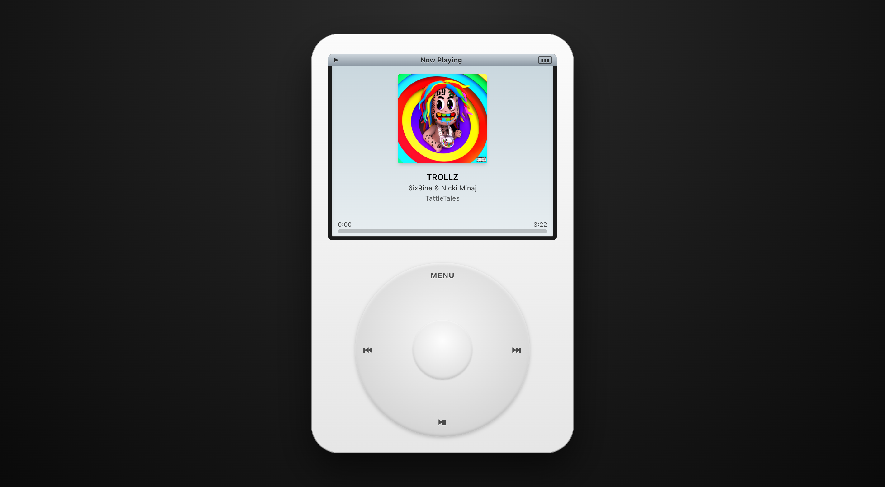

# iPod



A web-based recreation of the classic iPod that controls your real Apple Music library on macOS. The frontend renders a click-wheel UI; an Express bridge translates HTTP requests into AppleScript commands against `Music.app`.

Browsers can't talk to native apps directly, so this only works on a Mac with `Music.app` open and signed into your Apple Music account. The trade-off versus a public web app: no Apple Developer fee, full library access, real album art, real playback.

## Requirements

- macOS with `Music.app` set up and signed in
- Node.js 20+
- On first request, macOS prompts to allow the bridge to control Music — accept it (System Settings → Privacy & Security → Automation).

## Getting started

```bash
npm install
npm run dev
```

This starts:

- **Web** (Vite) on http://localhost:5173
- **Bridge** (Express) on http://localhost:3001

Vite proxies `/api/*` to the bridge, so the frontend just calls `/api/...`.

## Scripts

| Script               | What it does                        |
| -------------------- | ----------------------------------- |
| `npm run dev`        | Run web + bridge concurrently       |
| `npm run dev:web`    | Vite only                           |
| `npm run dev:bridge` | Bridge only (tsx watch)             |
| `npm run build`      | Type-check and build the web bundle |
| `npm run preview`    | Preview the production build        |
| `npm run lint`       | Run ESLint                          |

## UI

- **Click wheel** — drag around the wheel to scroll the menu (authentic touch-wheel feel), plus the four labelled regions (`MENU`, `⏮`, `⏭`, `⏯`) and the centre select button are clickable.
- **Keyboard** — `↑`/`↓` scroll, `Enter` select, `Esc`/`Backspace` go back, `Space` play/pause, `←`/`→` previous/next track.
- **Title bar** — play/pause indicator on the left, view title in the centre, real Mac battery indicator on the right (turns amber under 30%, red under 15%, shows a charging bolt when on AC).
- **Now Playing** — album art, title/artist/album, position/remaining, progress bar.
- **Next/Previous** — traverse the playlist queue you started from (frontend tracks the queue; `next track` in `Music.app` is unreliable for playlist context).

## Architecture

```
src/                       React 19 + Tailwind v4 frontend
  App.tsx                  Thin orchestration: nav reducer + effects wiring
  ipod/
    ClickWheel.tsx         SVG wheel with drag-to-scroll + clickable regions
    Screen.tsx             Title bar + body switch (Menu vs NowPlaying)
    MenuList.tsx           Scrollable list with selection highlight
    NowPlaying.tsx         Album art, track info, progress bar
    BatteryIcon.tsx        SVG battery widget
  hooks/
    useWheel.ts            Drag math: angle deltas → scroll ticks
    usePlayer.ts           Polls /api/player/state every 1s
    useBattery.ts          Polls /api/system/battery every 30s
    useQueue.ts            Playback queue + next/prev within playlist
    useNavKeyboard.ts      Keyboard bindings
  state/
    api.ts                 Typed fetch wrappers + simple TTL cache
    nav.ts                 Navigation reducer (push/pop/scroll/set-data)
    loadView.ts            Per-view data loader + title resolver
    types.ts               View, Frame, NavState, NavAction
server/                    Express bridge
  index.ts                 App entry, mounts routes on :3001
  applescript.ts           runScript / parseTsv / escapeAS helpers
  cache.ts                 In-memory TTL memo
  routes/
    library.ts             Playlists, artists, albums, songs, genres, tracks
    player.ts              State + transport controls
    artwork.ts             Album art (binary stream)
    system.ts              Battery (pmset)
```

### Identifiers

Tracks and playlists are referenced by **persistent ID** (a stable hex string assigned by `Music.app`). Earlier versions used numeric database IDs; persistent IDs are reliable across `whose` filters for cloud-only Apple Music tracks too.

### Performance notes

- Library reads are cached for 60s in the bridge.
- Bulk property fetches: `<prop> of every track of library playlist 1` runs in a single Apple Event, then values are zipped in AppleScript's native list space — ~10× faster than iterating tracks one by one. Artists/Genres go via even leaner single-property scripts.
- The frontend caches in-flight `GET`s, so navigating back into a view doesn't refetch.
- Songs are sorted by **date added (most recent first)** in the bridge, computed from `date added of every track` and a locale-safe epoch.

### Navigation model

Each entry in the navigation stack is a `Frame` that owns its own `items`, `tracks`, `selected` index, and `loaded` flag. Pushing creates a new empty frame; popping discards the top. The data-load effect fires per view change and dispatches a `set-data` action; the reducer ignores writes whose `viewKey` no longer matches the current top frame, so a stale fetch from a popped view can't bleed into a new one.

React keys for track rows are prefixed with the row index (`${i}-${id}`) because a single playlist can legitimately contain the same track multiple times — without the prefix, React's reconciler leaves orphan DOM nodes when you navigate away.

## API reference

Base URL: `http://localhost:3001`

All responses are JSON unless noted. Errors return `500 { error: string }`.

### Library — `/api/library`

| Method | Path                     | Response                                                                |
| ------ | ------------------------ | ----------------------------------------------------------------------- |
| GET    | `/playlists`             | `[{ id, name, kind: "user" \| "smart", count }]`                        |
| GET    | `/playlists/:pid/tracks` | `[{ id, name, artist, album, duration }]`                               |
| GET    | `/songs?offset=&limit=`  | `{ total, items: [Track] }` — `limit` 1–500. Sorted by date added desc. |
| GET    | `/artists`               | `[{ name, count }]`                                                     |
| GET    | `/artists/:name/albums`  | `[{ name, artist }]`                                                    |
| GET    | `/albums`                | `[{ name, artist }]`                                                    |
| GET    | `/albums/:name/tracks`   | `[Track]`                                                               |
| GET    | `/genres`                | `[{ name, count }]`                                                     |
| GET    | `/genres/:name/tracks`   | `[Track]`                                                               |

`Track` = `{ id: string, name, artist, album, genre, duration: number /* seconds */, addedAt: number /* unix seconds */ }`. All `id` and `:pid` values are Music persistent IDs.

### Player — `/api/player`

| Method | Path         | Body                        | Notes                                                                  |
| ------ | ------------ | --------------------------- | ---------------------------------------------------------------------- |
| GET    | `/state`     | —                           | `{ state, name, artist, album, duration, position, id }`               |
| POST   | `/play`      | `{ trackId?, playlistId? }` | Omit both to resume. With both, plays the track within the playlist's source so next/previous follow the playlist order. |
| POST   | `/pause`     | —                           |                                                                        |
| POST   | `/playpause` | —                           | Toggle                                                                 |
| POST   | `/next`      | —                           |                                                                        |
| POST   | `/previous`  | —                           |                                                                        |
| POST   | `/seek`      | `{ position }`              | Seconds into the current track                                         |
| POST   | `/shuffle`   | —                           | Enables shuffle and plays the library                                  |

`state` is one of `"playing" | "paused" | "stopped" | "fast forwarding" | "rewinding"`. Mutating endpoints respond with `{ ok: true }`.

### Artwork — `/api/artwork`

| Method | Path   | Response                                                                                              |
| ------ | ------ | ----------------------------------------------------------------------------------------------------- |
| GET    | `/:id` | Image bytes (`image/jpeg` or `image/png`). `404` if no artwork. Cached for 1 day via `Cache-Control`. |

`:id` is a track persistent ID.

### System — `/api/system`

| Method | Path       | Response                          |
| ------ | ---------- | --------------------------------- |
| GET    | `/battery` | `{ percent: number, charging: boolean }` (via `pmset -g batt`) |

## Troubleshooting

- **Empty results / silent failures**: macOS may have blocked Automation. Open System Settings → Privacy & Security → Automation, find the terminal/Node entry, and enable "Music".
- **Tracks won't play**: cloud-only Apple Music tracks aren't always resolvable in `library playlist 1` by `whose persistent ID`; the bridge falls back to searching user playlists. If a track still won't play, it may not be in any of your playlists or the library.
- **Stale data**: library responses are cached for 60s. Restart `npm run dev:bridge` to clear.
- **Bridge port conflict**: set `PORT=3002 npm run dev:bridge` (and update the Vite proxy in `vite.config.ts` to match).
